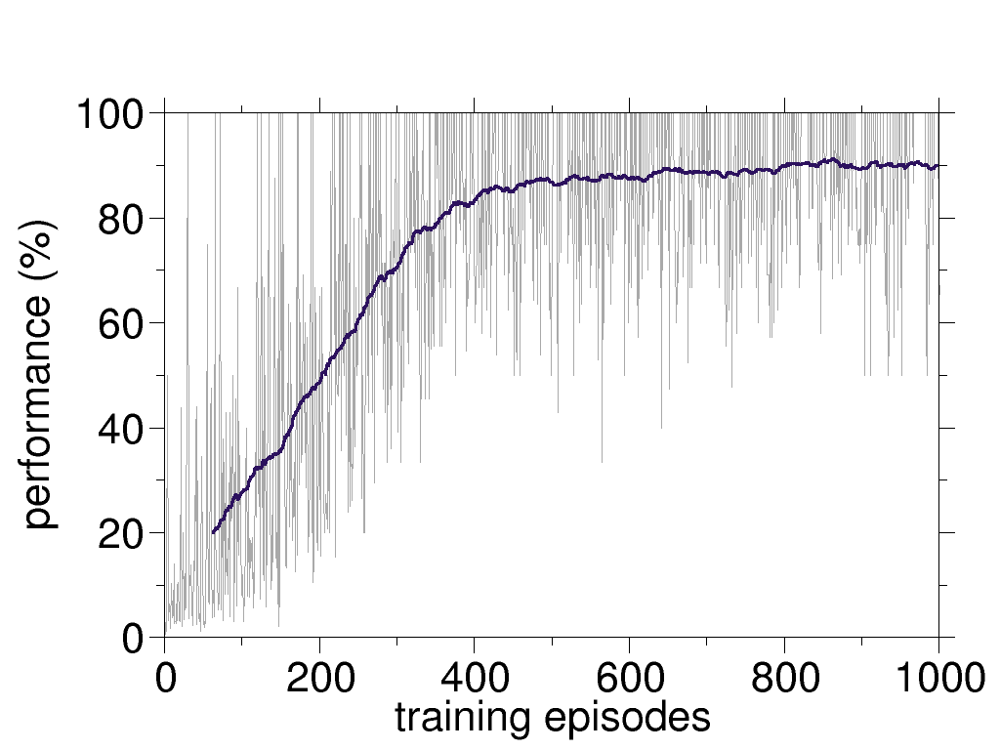
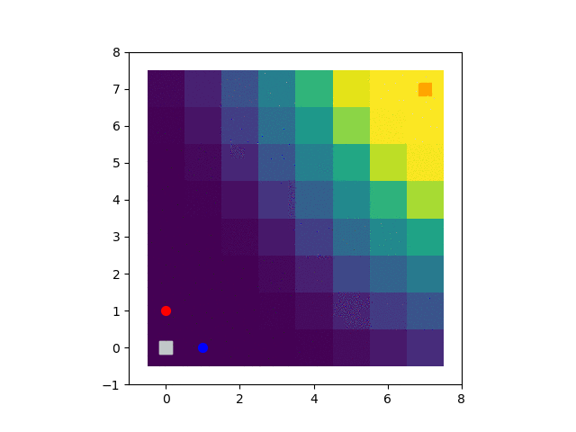
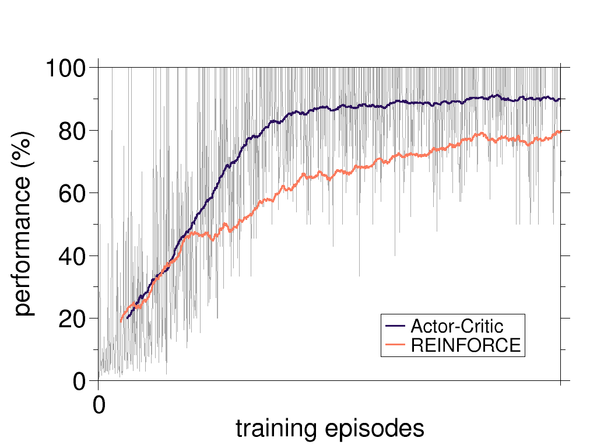

# simplest-world-REINFORCE

the *simplest-world* provides a simple environment for the agents. Here, the world is made ultimately simple to leave some room for the RL complications. This is the **second** steps in the series of clean implementations of different RL approaches. The world is square lattice where the agent starts randomly in any position and its goal is to get to the top-right corner of the field.

In this repository a simple implementation of REINFORCE is developed (on policy, policy gradient).
## requirements
Besides the python3 and pip3

* keras
* numpy
* random
* seaborn
* keras and tensorflow (version 2)
* matplotlib (for simulator.py)

```
pip3 install -r requirements.txt
```
## usage

To use it one can run:
```
python3 experience-and-learn.py
```
This script runs experiments for a random policy and improves it. The size of the world is 8x8 and it can be changed by setting the variable ```SYSTEM_SIZE``` (in ```experience-and-learn.py```) to the desired value.

## anatomy of the code

The code ```experience-and-learn.py``` creates an environment and an agent. The agent, initially, has a random policy and starts from a random position. Following the policy, agent takes one step after another until it reaches the terminal state (the goal). The trajectory of the agent, together with rewards associated with each step, is saved in a container (```hisotries```). Up to here, the agent has only sampled according to its policy. The history of this sampling, i.e. the states, the taken actions, and the associated rewards, are used to train the policy of the agent. After the training, the agent starts again and samples according to the improved policy. 

The environment is an instance of a class which has:
* ```__init__``` method which has all the actions and the reward at its initiation. Specifically it has rewards for reaching the goal, hitting the walls, and any other step, 
* a method named ```step``` with which the agent takes a step. The inputs to this method are the current state of the agent and the action to be taken. The outputs are the new state, the reward, and a flag which shows whether the agent has reached to the terminal state.

The agent is an instance of a class which has:
* ```__init__```  method which creates a deep neural network as agent's policy. In this implementation the policy has two hidden layers (64 and 5) both with ReLU activation functions. 
* ```learning``` method which implements the actor-critic approach.

## monitoring performance

An advantage of the simplest world is that we know almost everything about it! Specifically, given your initial state, one can calculate the number of steps to reach the terminal state under the **optimal** policy. Knowing the number of states to reach the goal, one can define a parameter to quantify the performance:

 


In the figure below,the performance is plotted as a function of the number of the trainings. The graph shows that the performance increases with more training.



To visualize the better performance of the trained agent, one can run two simulations: one for the agent before the training, and one for the trained agent. For the simulations one can use ```simulator.py```. The blue circle represents the position of the trained agent and the red circle depicts the position of the agent with no traingin. Clearly, the trained agent reaches the goal in an optimal fashion.

The color code represents the value function (for visualization purposes, the log of the shifted value function is used).




To run the simulation:

```
python3 simulator.py
```

and to convert the PNG files to a GIF by:


```
bash converting-pngs-to-gif.sh
```

in the ```animations``` directory.

## comparison to REINFORCE

The learning curves of the REINFORCE and Actor-Critics are compared together here. As expected the AC method leads to a faster convergence to the optimal policy.


